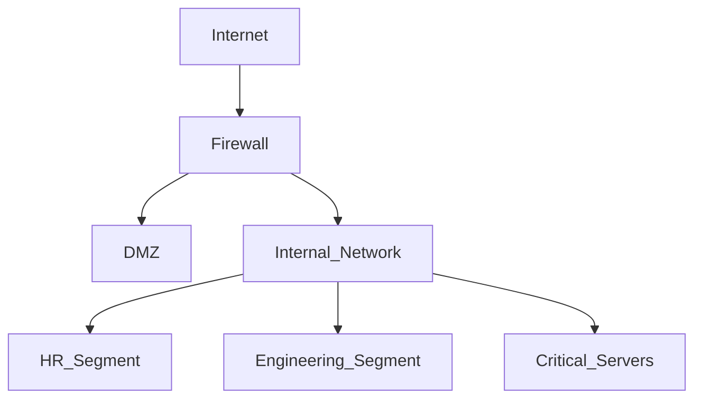

## Why Network Segmentation is Crucial

Network segmentation isn't a new concept, but its importance has never been greater. In an era of persistent threats and sophisticated attackers, a flat network is a defender's nightmare. Once an attacker gains a foothold, they can move laterally with ease, escalating privileges and accessing sensitive data.

### The Core Principle

The goal of segmentation is to divide a larger network into smaller, isolated sub-networks or "segments". Traffic between these segments is then strictly controlled by firewalls or other filtering mechanisms.

